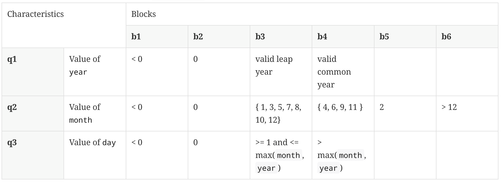

# Test the Date class

Implement a class `Date` with the interface shown below:

```java
class Date implements Comparable<Date> {

    public Date(int day, int month, int year) { ... }

    public static boolean isValidDate(int day, int month, int year) { ... }

    public static boolean isLeapYear(int year) { ... }

    public Date nextDate() { ... }

    public Date previousDate { ... }

    public int compareTo(Date other) { ... }

}
```

The constructor throws an exception if the three given integers do not form a valid date.

`isValidDate` returns `true` if the three integers form a valid year, otherwise `false`.

`isLeapYear` says if the given integer is a leap year.

`nextDate` returns a new `Date` instance representing the date of the following day.

`previousDate` returns a new `Date` instance representing the date of the previous day.

`compareTo` follows the `Comparable` convention:

- `date.compareTo(other)` returns a positive integer if `date` is posterior to `other`
- `date.compareTo(other)` returns a negative integer if `date` is anterior to `other`
- `date.compareTo(other)` returns `0` if `date` and `other` represent the same date.
- the method throws a `NullPointerException` if `other` is `null`

Design and implement a test suite for this `Date` class.
You may use the test cases discussed in classes as a starting point.
Also, feel free to add any extra method you may need to the `Date` class.

Use the following steps to design the test suite:

1. With the help of _Input Space Partitioning_ design a set of initial test inputs for each method. Write below the characteristics and blocks you identified for each method. Specify which characteristics are common to more than one method.
2. Evaluate the statement coverage of the test cases designed in the previous step. If needed, add new test cases to increase the coverage. Describe below what you did in this step.
3. If you have in your code any predicate that uses more than two boolean operators check if the test cases written to far satisfy _Base Choice Coverage_. If needed add new test cases. Describe below how you evaluated the logic coverage and the new test cases you added.
4. Use PIT to evaluate the test suite you have so far. Describe below the mutation score and the live mutants. Add new test cases or refactor the existing ones to achieve a high mutation score.

Use the project in [tb3-date](../code/tb3-date) to complete this exercise.

## Answer

1. Dans le cours, il y a les caractéristiques et blocs suivants pour la méthode `isValidDate`:



Les blocs de partition que nous avons identifiés dans le cours pour la méthode `isValidDate` sont les suivants :

- `{ day: 1, month: 1, year: -1}`
- `{ day: -1, month: -1, year: 0}`
- `{ day: 0, month: 4, year: 2020}`
- `{ day: -2, month: 0, year: 2019}`
- `{ day: 29, month: 2, year: 2019}`
- `{ day: 0, month: 13, year: 2018}`

Pour la méthode `isLeapYear`, nous pouvons indentifier les caractéristiques et blocs suivants:

| Caractéristique              | b1   | b2    |
| ---------------------------- | ---- | ----- |
| C1 = Année divisible par 4   | True | False |
| C2 = Année divisible par 100 | True | False |
| C2 = Année divisible par 400 | True |       |

Nous permettant d'identifier les blocs de partition suivant:
| C | b1 | b2 |
|----|----------|----------|
| C1 | 8 | 10 |
| C2 | 200 | 150 |
| C2 | 800 | |

Pour la méthode `nextDate`, nous identifions les caractéristiques et blocs suivants:

| Caractéristique                                  | b1   | b2    |
| ------------------------------------------------ | ---- | ----- |
| C1 = Date correspond au dernier jour d'un mois   | True | False |
| C2 = Date correspond au dernier jour d'une année | True |       |

Nous permettant d'identifier les blocs de partition suivant:
| C | b1 | b2 |
|----|------------------------------------|-----------------------------------|
| C1 | `{ day: 31, month: 1, year: 2018}` | `{ day: 5, month: 3, year: 2024}` |
| C2 | `{ day: 31, month: 12, year: 1872}`| |

Pour la méthode `previousDate`, de manière similaire nous identifions les caractéristiques les blocs:

| Caractéristique                                  | b1   | b2    |
| ------------------------------------------------ | ---- | ----- |
| C1 = Date correspond au premier jour d'un mois   | True | False |
| C2 = Date correspond au premier jour d'une année | True |       |

Nous permettant d'identifier les blocs de partition suivants:
| C | b1 | b2 |
|----|------------------------------------|-----------------------------------|
| C1 | `{ day: 1, month: 06, year: 2018}` | `{ day: 5, month: 3, year: 2024}` |
| C2 | `{ day: 1, month: 1, year: -100}` | |

Enfin, pour la méthode `compareTo` nous identifions les caractèristiques suivantes:
| Caractéristique | b1 | b2 | b3 |
|---------------------------------------------------|-----|-----|-----|
| C1 = Différence entre la date 1 et la date 2 | < 0 | = 0 | > 0 |

Avec les blocs de partition suivants:
| C | b1 | b2 | b3 |
|----|------------------------------------|-----------------------------------|-----------------------------------|
| C1 | `{ day: 12, month: 06, year: 120}, { day: 27, month: 08, year: 2018}` | `{ day: 5, month: 3, year: 2024}, { day: 5, month: 3, year: 2024}` | `{ day: 5, month: 3, year: 3007}, { day: 2, month: 7, year: 1932}` |

La caractéristique "value of `year`" est commune à `isValidDate`, `isLeapYear`, `nextDate`, `previousDate` et `compareTo`.

La caractéristique "value of `month`" est commune à `isValidDate`, `nextDate`, `previousDate` et `compareTo`.

La caractéristique "value of `day`" est commune à `isValidDate`, `nextDate`, `previousDate` et `compareTo`.

2. Après avoir implémenter les tests de l'étape précdédente, nous obtenons la couverture de code suivante :


Ajout des tests suivants :

- `(Date(31, 12, -1)).nextDate()` où l'on attend `Date(1, 1, 1);`
- `(Date(1, 3, 2024)).previousDate()` où l'on attend `Date(29, 2, 2024);`
- `(Date(1, 3, 2023)).previousDate()` où l'on attend `Date(28, 2, 2023);`
- `(Date(1, 5, 2024)).previousDate()` où l'on attend `Date(30, 4, 2024);`
- `(Date(1, 1, 1)).previousDate()` où l'on attend `Date(31, 12, -1);`
- `new Date(32, 13, 2022)` où l'on s'attend à recevoir une exception

Suite à cela, nous avons atteint un coverage de 100%.

3. Nos cas de test actuels ne satisfont pas le "Base Choice Coverage". Afin d'améliorer celui-ci nous avons ajouté les tests suivants :

- Pour `compareTo()`, une date où le jour et le mois des deux dates sont égaux mais que l'année est différente et une date où le jour et l'année des deux dates sont égaux mais que le mois est différent.
- Pour `isValidDate()`, 5/9/2020, 5/10/2020 et 5/11/2020 car c'était les mois qu'il manquait.
- Pour `previousDate()`, nous avons du ajouter un test pour chaque mois qu'il manquait :
  - `(Date(1, 7, 2024)).previousDate()` où l'on attend `Date(30, 6, 2024);`
  - `(Date(1, 10, 2024)).previousDate()` où l'on attend `Date(30, 9, 2024);`
  - `(Date(1, 12, 2024)).previousDate()` où l'on attend `Date(30, 11, 2024);`
  - `(Date(1, 2, 2024)).previousDate()` où l'on attend `Date(31, 1, 2024);`
  - `(Date(1, 4, 2024)).previousDate()` où l'on attend `Date(31, 3, 2024);`
  - `(Date(1, 8, 2024)).previousDate()` où l'on attend `Date(31, 7, 2024);`
  - `(Date(1, 9, 2024)).previousDate()` où l'on attend `Date(31, 9, 2024);`
  - `(Date(1, 11, 2024)).previousDate()` où l'on attend `Date(31, 10, 2024);`

Les conditions mois par mois des différentes méthodes (`previousDate`par exemple) nécessitent un logique de test un peu barbare où chaque mois doit être testé.

Suite à cet ajout, nous avons atteint 100% de Base Choice Coverage.

4. Après avoir lancé PIT, le Mutation Coverage est de 97%. Effectivement 3 mutants on survécut à un changement d'inégalité dans la méthode `compareTo`. Toutefois, cela ne semble pas possible de tuer ces mutants étant donné le test d'égalité des dates à la ligne précédente. Peu importe que l'on teste si la date est inférieure stricte ou non, on obtiendra le même résultat.
